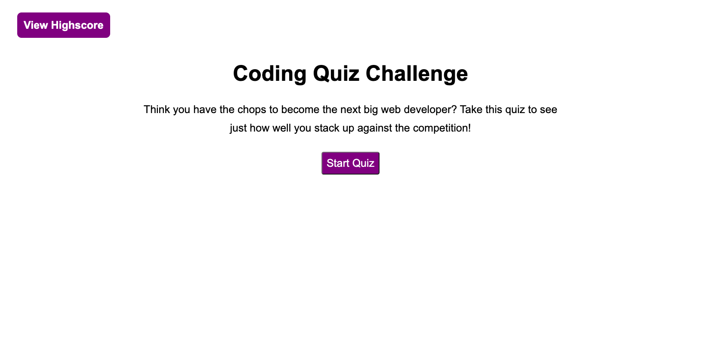
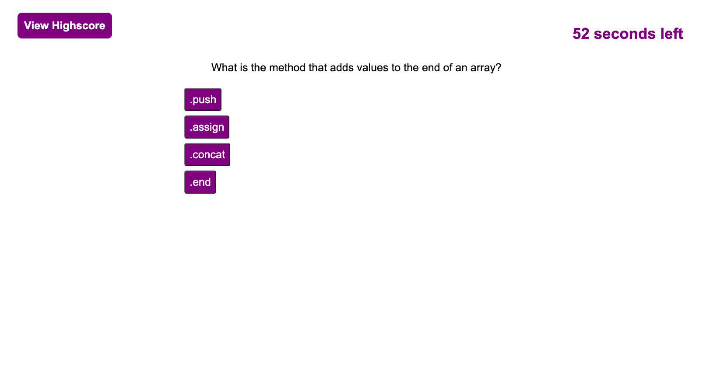
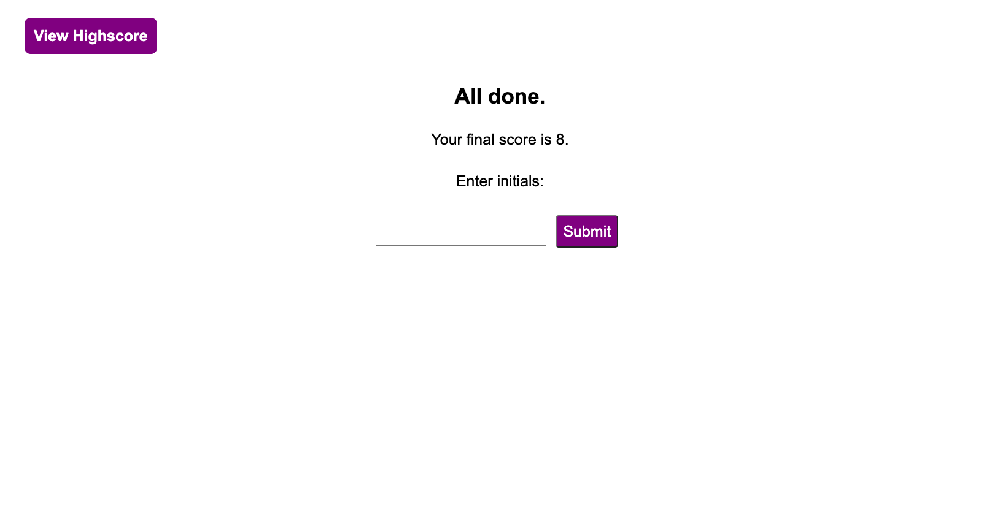
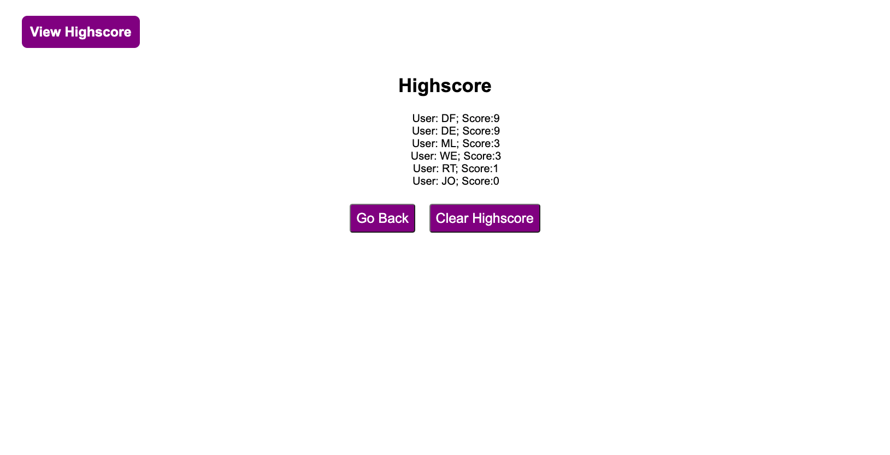

# Devon Faria - Quiz Game

[Link to working page](https://devonfaria.github.io/quiz-game/)

## Table of Contents

* [Description](#description)
* [Visuals](#visuals)
* [Support](#Support)
* [Contributions](#contributions)

## Description

Welcome to the quiz game I created! Once you click the start button, you will switch to a question page where you will be presented with a question and 4 possible answers. 

Clicked answers are compared against the correct answer by comparing innerHTML elements to the correct answer. Correct answers will cause their score to raise by 1. Your score will remain the same and your seconds left will detract 5 seconds if you are incorrect. Both correct and incorrect answers will load the next question until question 10. 

Then you will be presented with your final score, on the end screen, and you can input your initials and score to a highscore page. This page stores the last set of highscore details.

## Visuals

The following layout is what you can expect to see on your browser.

This is the loading screen before you begin the quiz.

This is the screen with a question. All answers are clickable and the timer will run in the upper right hand corner. 

Once the timer reaches zero or the questions are completed, the game will flip to this screen.

Once you submit your initials on the end screen, then your will save them to your localStorage. This page displays the last score. 

## Support

Contact me at devonfaria@gmail.com if you need assistance downloading or activating this repository.

## Contributions

A huge thank you to the UNCC Virtual Bootcamp for providing me with the knowledge to create such an intricate function, and the support to code it correctly!